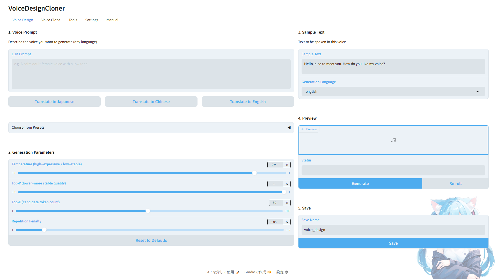

# VoiceDesignCloner

**A training data creation tool for building complete TTS models from original AI voices — no recording required.**

Solves the hardest problems in voice synthesis: **recording, corpus building, bulk generation, and resampling**.

A GUI tool for [Qwen3-TTS](https://huggingface.co/Qwen/Qwen3-TTS) and [Irodori-TTS](https://github.com/Aratako/Irodori-TTS) — VoiceDesign / VoiceClone / LoRA fine-tuning.
From voice design and bulk synthesis for [Style-Bert-VITS2](https://github.com/litagin02/Style-Bert-VITS2) training data, all the way to LoRA fine-tuning of Irodori-TTS — everything in one place.

**Switch UI language, bundled corpus, and generation language with one click — JA / EN / ZH / KO supported**

---

## Overview

**Solves the voice problems that have been holding back AI Tubers, AI characters, game voice, and narration production.**

- Can't prepare original recordings, so you can't create a voice
- Running zero-shot inference without a proper TTS model
- Corpus collection and bulk audio generation are too much work

Voice design, bulk generation, and preprocessing — done in just a few button clicks.

**What you can do:**
- **Voice Design** — Generate a completely original voice from scratch using text prompts
- **Voice Gacha** — Keep regenerating until you find the voice you love
- **Bulk Corpus Synthesis** — Generate hundreds to thousands of lines with your chosen voice at the push of a button
- **LoRA fine-tuning** (Irodori-TTS) — Train a LoRA on your clone output, seamlessly
- **Resample & esd.list generation** — Preprocessing for Style-Bert-VITS2 training, all handled automatically

Output is in Style-Bert-VITS2 training data format (44.1kHz WAV + esd.list), ready to use directly.
Output can also be used with other TTS engines.

---

## Screenshots



---

## Requirements

| Item | Requirement |
|---|---|
| OS | Windows 11 / Linux WSL2 (tested) |
| Python | 3.10–3.12 (recommended: 3.12) |
| GPU | NVIDIA (CUDA required) |
| VRAM | 8GB+ (recommended: 16GB) |

**Tested environments:**

| OS | GPU | VRAM | RAM |
|---|---|---|---|
| Windows 11 | RTX 4060 Ti | 16GB | 128GB |
| Windows 11 | RTX 3060 | 12GB | 64GB |
| Windows 11 / WSL2 (Ubuntu 22.04) | RTX 5070 | 12GB | — |
| Windows 11 (VRAM 8GB) | — | 8GB | — |

> CPU-only operation has not been tested.

---

## Installation

```
1. Clone this repository or download as ZIP
2. Double-click setup.bat to run
3. After setup, launch with app.bat
```

**On Linux, use `setup.sh` / `app.sh`. Tested on WSL2 (Ubuntu 22.04).**

`setup.bat` automatically handles venv creation, PyTorch, and all dependency installation.

If an NVIDIA GPU is detected, both **faster-qwen3-tts** and **Irodori-TTS** are installed automatically.
Because Irodori-TTS requires a different torch build (2.10/cu128) that's incompatible with Qwen3-TTS's, it lives in its own venv:

- Install location: `%USERPROFILE%\.vdc-engines\Irodori-TTS\` (Linux: `~/.vdc-engines/`)
- vdc launches it as a subprocess worker

PyTorch is selected automatically based on your GPU. RTX 50-series GPUs use `cu128`; other NVIDIA GPUs use `cu118`.
To override the automatic selection, set the `VDC_TORCH_CUDA` environment variable.

Windows:
```
set VDC_TORCH_CUDA=cu128
setup.bat
```

Linux / WSL2:
```
VDC_TORCH_CUDA=cu128 ./setup.sh
```

To add faster-qwen3-tts manually later:

```
venv\Scripts\activate
pip install faster-qwen3-tts
```

> **First launch note**: On the first run, the faster backend may fall back to standard. From the second run onward, faster will work correctly.

---

## Usage

After launching, step-by-step instructions are available in the **Manual tab** inside the app.

General workflow:

```
1. [Voice Design]    tab — Design, preview, and save your voice
2. [Voice Clone]     tab — Bulk synthesize your corpus with the saved voice (optional: train a LoRA when done)
3. [LoRA]            tab — Fine-tune Irodori-TTS with a LoRA adapter (can be run standalone too)
4. [Irodori Infer]   tab — Play with a trained LoRA one line at a time, save with a custom name
5. [Tools]           tab — Resample and generate esd.list
6. [Settings]        tab — Check and switch inference backend (Qwen3-TTS / faster / Irodori-TTS)
```

Steps 1 and 2 are all you need for basic use. LoRA / Irodori Inference shine when the **Irodori-TTS** backend is selected.

> **Note**: Pressing the stop button in Voice Clone will show "Error" in the status display. This is a Gradio behavior — the process has actually stopped correctly. All generated files are preserved.

---

## Supported Languages

### UI Language

Switchable from the Settings tab.

| Language | Code |
|---|---|
| Japanese | JA |
| English | EN |
| Chinese | ZH |
| Korean | KO |

### Voice Generation Language (Qwen3-TTS)

Both Voice Design and Voice Clone support the following 10 languages.
When using bundled corpora (JA/EN/ZH), the corpus language selector syncs automatically.
When using your own corpus, you can generate in all 10 languages.

| Language | Language |
|---|---|
| Japanese | Korean |
| English | German |
| Chinese | French |
| Spanish | Italian |
| Portuguese | Russian |

---

## Bundled Corpora

| File | Lines | Content |
|---|---|---|
| ita_emotion100.txt | 100 | ITA corpus (emotional expressions) |
| ita_recitation324.txt | 324 | ITA corpus (recitation) |
| mana652.txt | 652 | MANA corpus |
| rohan4600.txt | 4600 | ROHAN corpus |

Japanese (JA) is included as-is. English (EN) and Chinese (ZH) were translated offline using M2M-100, with all looping outputs and unknown token artifacts (`<unk>`) manually corrected.

---

## Passing Data to Style-Bert-VITS2

```
1. Copy the contents of output/{folder}/raw/ to Style-Bert-VITS2's Data/{model}/raw/
2. Generate esd.list using "Generate esd.list" in the Tools tab
3. Run preprocessing → training in the Style-Bert-VITS2 WebUI
```

esd.list format:
```
0001.wav|{speaker_name}|JP|text content
0002.wav|{speaker_name}|JP|text content
```

> **Note**: The language column can be set to JP / EN / ZH from the Tools tab.

---

## Inference Backends

| Backend | Engine | Speed | Languages | Notes |
|---|---|---|---|---|
| **faster** (recommended) | Qwen3-TTS | ~6–10x faster (RTF ~2.0) | 10 | GPU required, 0.6B-Base unsupported |
| **Qwen3-TTS** | Qwen3-TTS | Standard speed | 10 | CPU/GPU |
| **Irodori-TTS** | Irodori-TTS | ~6–7 s/sentence | Japanese only | GPU required, 48kHz diffusion, LoRA support |

The faster backend uses CUDA Graph optimization via [faster-qwen3-tts](https://github.com/andimarafioti/faster-qwen3-tts).
**0.6B-Base is not supported by faster** — when faster is selected, it automatically falls back to standard for this model.

Selecting the Irodori-TTS backend switches Voice Design / Voice Clone tabs to Japanese-only mode and enables the LoRA and Irodori Inference tabs.
Switching backends auto-restarts the app so every tab renders with the appropriate lock state.

On the first Irodori-TTS generation, the app checks/downloads models from Hugging Face. Progress is printed to the console with `[Irodori] Checking/downloading checkpoint...` and related messages.

---

## License

This tool: [MIT License](LICENSE)

OSS used:
- [Qwen3-TTS](https://huggingface.co/Qwen/Qwen3-TTS) — Apache License 2.0
- [faster-qwen3-tts](https://github.com/andimarafioti/faster-qwen3-tts) — Apache License 2.0
- [Irodori-TTS](https://github.com/Aratako/Irodori-TTS) — MIT License (model card includes additional ethical restrictions)
- [Semantic-DACVAE-Japanese-32dim](https://huggingface.co/Aratako/Semantic-DACVAE-Japanese-32dim) — MIT License
- [M2M-100](https://huggingface.co/facebook/m2m100_418M) — MIT License
- [Gradio](https://github.com/gradio-app/gradio) — Apache License 2.0
- ITA corpus / ROHAN corpus / MANA corpus — Public Domain

Details: [THIRD_PARTY_LICENSES.md](THIRD_PARTY_LICENSES.md)

---

## Disclaimer

This tool is a GUI wrapper for Qwen3-TTS (Apache License 2.0) and Irodori-TTS (MIT License).

### About Qwen3-TTS Training Data

The training data of Qwen3-TTS is a black box — its contents and rights status have not been disclosed.
For commercial use, please carefully review the Qwen3-TTS terms of service.

### About Irodori-TTS Ethical Restrictions

The Irodori-TTS model cards add the following ethical restrictions on top of the MIT License:

- Do not intentionally impersonate real individuals, voice actors, or public figures without their consent
- Do not generate audio intended for misinformation or deepfake purposes
- The developers assume no liability for misuse (user responsibility)

When using the LoRA training / inference features, please comply with these restrictions as well.

### Publicity Rights, Copyright, and Related Laws

Cloning or using the voice of a real person, talent, or voice actor for commercial purposes without permission may constitute infringement of publicity rights, copyright, unfair competition prevention laws, and other applicable regulations.
The legal risks differ significantly between personal and commercial use.

### Prohibited Uses

- Use for fraud, impersonation, or defamation
- Generation or distribution of audio content that is illegal or infringes on rights

### Other

- The developer assumes no responsibility for any audio content generated with this tool
- This software is provided as-is, without any warranty of any kind

---

## Support / Contact

- Bug reports & feature requests: Please use GitHub Issues in this repository
- Other inquiries: Please DM via [Reine Honoka's X account](https://x.com/ReineHonoka)

## Special Thanks

Thank you to everyone who contributed to the development of this project.

### Testers

- [フルエレ](https://x.com/fluele_alpha?s=20)
- [きんくまん](https://x.com/kinkuman_net?s=20)
- [ヒロナ](https://x.com/hirona98?s=20)

### Contributors
- kinkuman — fix: setup.sh numpy pre-install & pip upgrade
