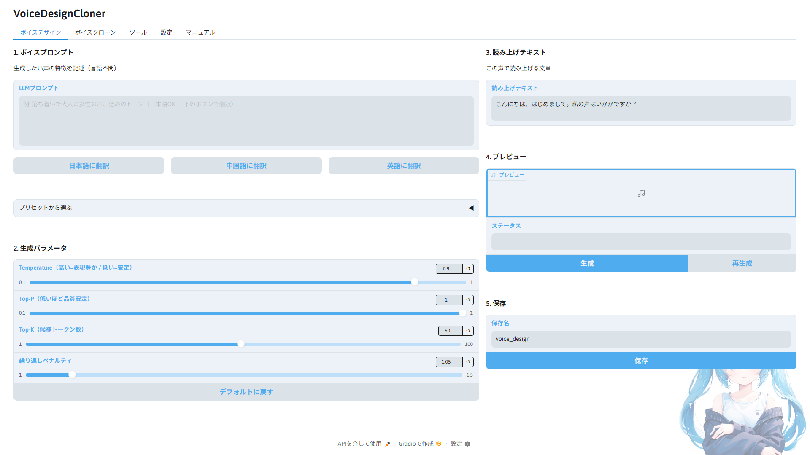

# VoiceDesignCloner

[English README](README.en.md)

**録音不要でオリジナルなAI音声から完全なTTSモデルを作るための教師データ作成ツール。**

音声合成で大変な**録音・コーパス構築・量産・リサンプル**の問題を解決。

[Qwen3-TTS](https://huggingface.co/Qwen/Qwen3-TTS) と [Irodori-TTS](https://github.com/Aratako/Irodori-TTS) の VoiceDesign / VoiceClone / LoRA学習 を GUI で操作できるツールです。
声の設計から [Style-Bert-VITS2](https://github.com/litagin02/Style-Bert-VITS2) の学習用教師データ作成、さらに Irodori-TTS の LoRA ファインチューンまで、一気通貫で完結します。

**UI表示・梱包コーパス・音声生成言語をワンクリックで切り替え — JA / EN / ZH / KO 対応**

---

## 概要

**AITuberやAIキャラ、ゲームボイスやナレーション制作に悩んでいた音声問題をまとめて解決。**

- オリジナルの録音が用意できず、声を作れない
- ゼロショット運用のまま、まともなTTSモデルを動かせていない
- コーパス集めと大量音声生成が大変

声の設計・量産・前処理まで、数回のボタン操作で完結。

**できること：**
- **声の設計** — テキストプロンプトでゼロからオリジナルの声を生成
- **声ガチャ** — 気に入るまで何度でもやり直し可能
- **コーパス一括音声化** — 選んだ声で数百〜数千文をボタン一つで量産
- **LoRAファインチューン**（Irodori-TTS） — クローン出力をそのまま学習データに、シームレスにLoRA学習
- **リサンプル・esd.list生成** — Style-Bert-VITS2学習に必要な前処理まで完結

出力はStyle-Bert-VITS2の学習データ形式（44.1kHz WAV + esd.list）で直接渡せます。
その他音声合成エンジンでも使用できる形で出力できます。

---

## スクリーンショット



---

## 必要環境

| 項目 | 要件 |
|---|---|
| OS | Windows 11 / Linux WSL2（動作確認済み） |
| Python | 3.10〜3.12（推奨: 3.12） |
| GPU | NVIDIA（CUDA対応） |
| VRAM | 8GB〜（推奨: 16GB） |

**動作確認済み環境:**

| OS | GPU | VRAM | RAM |
|---|---|---|---|
| Windows 11 | RTX 4060 Ti | 16GB | 128GB |
| Windows 11 | RTX 3060 | 12GB | 64GB |
| Windows 11 / WSL2 (Ubuntu 22.04) | RTX 5070 | 12GB | — |
| Windows 11 (VRAM 8GB) | — | 8GB | — |

> CPU 単体動作は未確認です。

---

## インストール

```
1. このリポジトリをクローンまたはZIPでダウンロード
2. setup.bat をダブルクリックして実行
3. 完了後、app.bat で起動
```

**Linux の場合は `setup.sh` / `app.sh` を使用してください。WSL2 (Ubuntu 22.04) で動作確認済みです。**

`setup.bat` が venv の作成・PyTorch・依存ライブラリのインストールをすべて自動で行います。

NVIDIA GPU が検出された場合、**faster-qwen3-tts** と **Irodori-TTS** が自動でインストールされます。
Irodori-TTS は torch のバージョンが Qwen3 と非互換（2.10/cu128）なので、専用の venv で別管理しています。

- インストール先: `%USERPROFILE%\.vdc-engines\Irodori-TTS\`（Linux: `~/.vdc-engines/`）
- vdc 本体からはサブプロセスのワーカーとして呼び出されます

後から faster-qwen3-tts を手動で追加する場合：

```
venv\Scripts\activate
pip install faster-qwen3-tts
```

> **初回起動について**: 初回のみ faster バックエンドが standard にフォールバックすることがあります。2回目以降は正常に faster で動作します。

### Google Colab で起動する

Colab ノートブック自体は同梱していませんが、以下のセルを **上から順にコピペ実行** すると、Colab 上で WebUI を起動し、Cloudflared で外部公開できます。

**前提:**
- Colab のランタイムは **GPU** を選択してください
- 初回は Hugging Face からモデルをダウンロードするため時間がかかります
- Cloudflared の Quick Tunnel は **開発・検証用** です

**1. セットアップ**

```bash
%%bash
set -euo pipefail

cd /content
if [ ! -d Voice-Design-Cloner ]; then
  git clone https://github.com/shinshin86/Voice-Design-Cloner.git
fi
cd /content/Voice-Design-Cloner

apt-get update
apt-get install -y sox ffmpeg curl wget

python -m pip install -U pip setuptools wheel

if command -v nvidia-smi >/dev/null 2>&1; then
  pip install torch torchaudio --index-url https://download.pytorch.org/whl/cu118
else
  pip install torch torchaudio --index-url https://download.pytorch.org/whl/cpu
fi

pip install numpy
pip install -r requirements.txt

if command -v nvidia-smi >/dev/null 2>&1; then
  pip install faster-qwen3-tts || true
fi

if [ ! -x /usr/local/bin/cloudflared ]; then
  wget -q https://github.com/cloudflare/cloudflared/releases/latest/download/cloudflared-linux-amd64 -O /usr/local/bin/cloudflared
  chmod +x /usr/local/bin/cloudflared
fi
```

**2. WebUI 起動 + Cloudflared 公開**

```bash
%%bash
set -euo pipefail

cd /content/Voice-Design-Cloner

LOG_DIR=/tmp/voice-design-cloner-colab
mkdir -p "$LOG_DIR"
APP_LOG="$LOG_DIR/app.log"
CLOUDFLARED_LOG="$LOG_DIR/cloudflared.log"

if ! curl -fsS http://127.0.0.1:7860/ > /dev/null 2>&1; then
  VDC_INBROWSER=0 VDC_SERVER_NAME=127.0.0.1 VDC_SERVER_PORT=7860 VDC_SHARE=0 \
    nohup python app.py > "$APP_LOG" 2>&1 &
  echo $! > "$LOG_DIR/app.pid"
fi

for _ in $(seq 1 120); do
  curl -fsS http://127.0.0.1:7860/ > /dev/null 2>&1 && break
  sleep 2
done

if ! curl -fsS http://127.0.0.1:7860/ > /dev/null 2>&1; then
  echo "[ERROR] WebUI が 7860 で応答しません。app.log を確認してください:"
  tail -n 80 "$APP_LOG" || true
  exit 1
fi

nohup cloudflared tunnel --url http://127.0.0.1:7860 > "$CLOUDFLARED_LOG" 2>&1 &
echo $! > "$LOG_DIR/cloudflared.pid"

PUBLIC_URL=""
for _ in $(seq 1 60); do
  PUBLIC_URL="$(grep -Eo 'https://[-a-z0-9]+\.trycloudflare\.com' "$CLOUDFLARED_LOG" | head -n 1 || true)"
  [ -n "$PUBLIC_URL" ] && break
  sleep 1
done

if [ -z "$PUBLIC_URL" ]; then
  echo "[ERROR] Cloudflared の公開URLを取得できませんでした。cloudflared.log を確認してください:"
  tail -n 80 "$CLOUDFLARED_LOG" || true
  exit 1
fi

echo ""
echo "[OK] VoiceDesignCloner on Colab"
echo "Public URL: ${PUBLIC_URL}"
echo "App log   : ${APP_LOG}"
echo "Tunnel log: ${CLOUDFLARED_LOG}"
```

起動に成功すると、`Public URL:` に `https://xxxxx.trycloudflare.com` が表示されます。そこへアクセスすると WebUI を開けます。

**3. 停止したい場合**

```bash
%%bash
pkill -f "python app.py" || true
pkill -f "cloudflared tunnel --url http://127.0.0.1:7860" || true
```

**言語切替 (日本語 / English / 中文 / 한국어) について**

- UI 上の **設定タブ** から表示言語を切り替えられます。切替後、アプリが自動で再起動します (このとき `VDC_RESTART=1` が設定され、ブラウザは再オープンしません)
- Colab 上でも、新しいプロセスが同じ 7860 ポートで再起動するため、Cloudflared の Public URL はそのまま使えます (1〜2 秒ほどトンネルが一時切断される場合があります。画面をリロードしてください)
- 設定は `config.json` に保存されますが、Colab のランタイム再接続時には初期化されることがあります

---

## 使い方

起動後、アプリ内の **Manual タブ** に手順が記載されています。

大まかな流れ：

```
1. [ボイスデザイン]  タブ — 声を設計・プレビュー・保存
2. [ボイスクローン]  タブ — 保存した声でコーパスを一括音声化（オプション: クローン完了後にLoRA学習）
3. [LoRA学習]      タブ — Irodori-TTS の LoRA ファインチューン（独立実行も可能）
4. [Irodori推論]   タブ — 学習済LoRAを1文ずつ試聴・名前付き保存
5. [ツール]         タブ — リサンプル・esd.list 生成
6. [設定]           タブ — 推論バックエンド確認・切替（Qwen3-TTS / faster / Irodori-TTS）
```

基本1と2だけで完結します。LoRA学習/Irodori推論はバックエンドが **Irodori-TTS** のときに本領発揮します。

> **注意**: Voice Clone の停止ボタンを押すと、ステータスが「エラー」と表示されます。これは Gradio の仕様で、実際には正常に停止しています。生成済みのファイルはそのまま残ります。

---

## 対応言語

### UI言語

設定タブから切り替え可能です。

| 言語 | コード |
|---|---|
| 日本語 | JA |
| 英語 | EN |
| 中国語 | ZH |
| 韓国語 | KO |

### 音声生成言語（Qwen3-TTS）

ボイスデザイン・ボイスクローンともに以下の10言語に対応しています。
梱包コーパス（JA/EN/ZH）を使う場合はコーパス言語セレクタで自動連動します。
自前コーパスを持ち込む場合は、上記10言語すべてで生成できます。

| 言語 | 言語 |
|---|---|
| 日本語 (Japanese) | 韓国語 (Korean) |
| 英語 (English) | ドイツ語 (German) |
| 中国語 (Chinese) | フランス語 (French) |
| スペイン語 (Spanish) | イタリア語 (Italian) |
| ポルトガル語 (Portuguese) | ロシア語 (Russian) |

---

## 梱包コーパスについて

| ファイル | 文数 | 内容 |
|---|---|---|
| aica.txt | 500文 | AICAコーパス（AIキャラ用） |
| ita_emotion100.txt | 100文 | ITAコーパス（感情表現） |
| ita_recitation324.txt | 324文 | ITAコーパス（朗読） |
| mana652.txt | 652文 | MANAコーパス |
| rohan4600.txt | 4600文 | ROHANコーパス |

日本語（JA）は原文そのままを収録。英語（EN）・中国語（ZH）は M2M-100 によるオフライン翻訳後、モデルのループ出力・未知語トークン（`<unk>`）をすべて手動で修正済みです。

### AICAコーパスについて

日本語のみAICAコーパスを追加いたしました。
AIキャラ専用に別途作成した500文のコーパスです。
[AICAコーパス](https://github.com/reinehonoka/aica-corpus)

---
## Style-Bert-VITS2 への受け渡し

```
1. output/{フォルダ名}/raw/ の中身を Style-Bert-VITS2 の Data/{モデル名}/raw/ にコピー
2. Tools タブの「esd.list 生成」で esd.list を作成
3. Style-Bert-VITS2 の WebUI で前処理 → 学習を実行
```

esd.list の形式：
```
0001.wav|{話者名}|JP|テキスト内容
0002.wav|{話者名}|JP|テキスト内容
```

> **注意**: 言語列は Tools タブで JP / EN / ZH から選択できます。

---

## 推論バックエンド

| バックエンド | エンジン | 速度 | 対応言語 | 備考 |
|---|---|---|---|---|
| **faster**（推奨） | Qwen3-TTS | 約6-10倍速（RTF ~2.0） | 10言語 | GPU必須・0.6B-Base非対応 |
| **Qwen3-TTS** | Qwen3-TTS | 標準速度 | 10言語 | CPU/GPU両対応 |
| **Irodori-TTS** | Irodori-TTS | 6-7秒/文 | 日本語のみ | GPU必須・48kHz拡散モデル・LoRA対応 |

faster バックエンドは [faster-qwen3-tts](https://github.com/andimarafioti/faster-qwen3-tts) による CUDA Graph 最適化を使用。
**0.6B-Base は faster 非対応**のため、fasterバックエンド選択中でも自動的に standard で動作します。

Irodori-TTS バックエンドを選択すると、ボイスデザイン/ボイスクローン両タブのUIが日本語固定モードに切り替わり、LoRA学習タブとIrodori推論タブが利用可能になります。
バックエンドを切り替えるとアプリが自動再起動し、各タブが対応するUI状態でレンダリングされます。

---

## ライセンス

本ツール: [MIT License](LICENSE)

使用しているOSS:
- [Qwen3-TTS](https://huggingface.co/Qwen/Qwen3-TTS) — Apache License 2.0
- [faster-qwen3-tts](https://github.com/andimarafioti/faster-qwen3-tts) — Apache License 2.0
- [Irodori-TTS](https://github.com/Aratako/Irodori-TTS) — MIT License（モデルカードに追加の倫理制限あり）
- [Semantic-DACVAE-Japanese-32dim](https://huggingface.co/Aratako/Semantic-DACVAE-Japanese-32dim) — MIT License
- [M2M-100](https://huggingface.co/facebook/m2m100_418M) — MIT License
- [Gradio](https://github.com/gradio-app/gradio) — Apache License 2.0
- ITAコーパス / ROHANコーパス / MANAコーパス — Public Domain

詳細: [THIRD_PARTY_LICENSES.md](THIRD_PARTY_LICENSES.md)

---

## 免責事項

本ツールは Qwen3-TTS（Apache License 2.0）および Irodori-TTS（MIT License）の GUI ラッパーです。

### Qwen3-TTS の学習データについて

Qwen3-TTS の学習データはブラックボックスであり、その内容・権利状況は公開されていません。
商用利用の際は Qwen3-TTS の利用規約を十分に確認してください。

### Irodori-TTS の倫理制限について

Irodori-TTS のモデルカードには MIT License に加えて以下の倫理制限が明記されています:

- 実在の人物・声優・著名人の声を**本人の許諾なく意図的に模倣**することの禁止
- 虚偽情報・ディープフェイク目的の音声生成の禁止
- 開発者は誤用について一切の責任を負わない（利用者責任）

LoRA 学習・推論機能を利用する場合は上記制限も遵守してください。

### パブリシティ権・著作権・関連法令について

実在の人物・タレント・声優の声を商用目的で無断クローン・使用することは、
パブリシティ権・著作権・不正競争防止法等の権利侵害に該当する可能性があります。
個人利用と商用利用では法的リスクが大きく異なります。

### 禁止事項

- 詐欺・なりすまし・誹謗中傷を目的とした利用
- 違法または権利侵害となる音声コンテンツの生成・配布

### その他

- 生成した音声コンテンツについて、開発者は一切の責任を負いません
- 本ソフトウェアは現状のまま提供され、いかなる保証も伴いません

---

## サポート / 連絡先

- バグ報告・機能要望: このリポジトリの GitHub Issues を利用してください
- その他の連絡: [零音ほのかのXアカウント](https://x.com/ReineHonoka)のDMにてお願いいたします。

## Special Thanks

このプロジェクトの開発にご協力いただいた皆様に感謝いたします。

### Testers

- [フルエレ](https://x.com/fluele_alpha?s=20)
- [きんくまん](https://x.com/kinkuman_net?s=20)
- [ヒロナ](https://x.com/hirona98?s=20)

### Contributors
- kinkuman — fix: setup.sh numpy pre-install & pip upgrade
